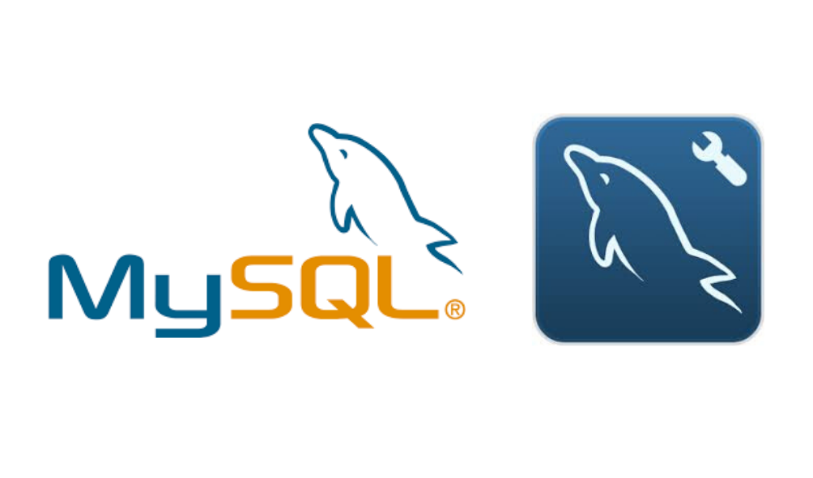

<h2 align="center"> MySQL DataBase</h2>

  
   </a>
    
  </a>
  
  
    
    
  </a>
  
  </a>
    
  </a>
  
  </a>
    
    
  </a>
   </a>
    
   
  

  
<table align="center">
  <tr>
    <td align="center" style="padding=0;width=50%;">
      
    </td>
  </tr>
</table>

MySQL Workbench es una herramienta visual de diseño de bases de datos que integra desarrollo de software, administración de bases de datos, diseño de bases de datos, gestión y mantenimiento para el sistema de base de datos MySQL. Es el sucesor de DBDesigner 4 de fabFORCE.net, y reemplaza el anterior conjunto de software, MySQL GUI Tools Bundle.

### MySQL GUI Tools Bundle

The MySQL Administrator part of GUI Tools
MySQL GUI Tools Bundle es una suite de código abierto y de multiplataforma de aplicaciones de escritorio para la administración de servidores de bases de datos MySQL, para construir y manipular los datos en una base de datos MySQL. Fue desarrollada por MySQL AB y después por Sun Microsystems y lanzada bajo la licencia GPL. Su desarrollo fue detenido, y ahora solo es preservado bajo los archivos de descarga del sitio de MySQL.

### MySQL Workbench 5.0 y 5.1
MySQL Workbench 5.0 y 5.1 son herramientas visuales especializadas para bases de datos MySQL. Mientras MySQL Workbench 5.0 era un producto exclusivo de MS Windows el soporte multiplataforma fue agregado a MySQL Workbench en la versión 5.1 y posterior.

## MySQL Workbench 5.2
A partir de MySQL Workbench 5.2, la aplicación evolucionó a una aplicación de base de datos general con interfaz gráfica. Aparte de modelado de base de datos física que cuenta con un editor de SQL y un servidor de base de datos Interfaz de administración, en sustitución de la antigua MySQL GUI Bundle herramientas. La nueva aplicación sin embargo todavía no es compatible con la migración de datos, que era una parte del conjunto de herramienta antigua.

## MySQL Workbench 6.2
El navegador esquema ahora incluye botones de acceso directo para las operaciones comunes como la vista de datos de tabla, el editor de tablas , y el inspector de la tabla / esquema.

## MySQL Workbench 6.3
El 5 de marzo de 2015, el equipo de MySQL Workbench anunció,11​ su primera edición beta para la versión 6.3. La primera versión estable se realizó el 23 de abril de 2015.12​

### Características

<ul><li>General:
<ul><li>Conexión y gestión de instancia de base de datos.</li>
<li>Asistente de elementos de acción.</li>
<li>Completamente compatible con <a href="/wiki/Script" title="Script">guiones</a> escritos en <a href="/wiki/Python" title="Python">Python</a> y <a href="/wiki/Lua" title="Lua">Lua</a>.</li>
<li>Soporte para complementos personalizados</li></ul></li>
<li>Editor de SQL:
<ul><li>Exploración de esquema de objetos.</li>
<li>Resaltado de sintaxis en SQL y analizador de declaraciones.</li>
<li>Conjuntos de resultados múltiples, editables.</li>
<li>Colecciones de fragmentos SQL.</li>
<li>Tunelización de conexión por SSH.</li>
<li>Soporte Unicode.</li></ul></li>
<li>Modelado de datos:
<ul><li>Diagrama entidad relación.</li>
<li>Modelado visual con <a href="/wiki/Arrastrar_y_soltar#Arrastrar_y_soltar" class="mw-redirect" title="Arrastrar y soltar"><i>arrastrar y soltar</i></a>.</li>
<li>Ingeniería inversa a guiones SQL y base de datos en vivo.</li>
<li>Ingeniería directa a guiones SQL y base de datos en vivo.</li>
<li>Sincronización de esquema.</li>
<li>Impresión de modelos.</li>
<li>Importación desde fabFORCE.net DBDesigner4.</li></ul></li>
<li>Administración de base de datos:
<ul><li>Iniciar y detener instancias de base de datos.</li>
<li>Configuración de instancias.</li>
<li>Administración de cuentas en base de datos.</li>
<li>Exploración de instancias variables.</li>
<li>Exploración de ficheros de registros.</li>
<li>Exportación e importación masiva de datos.</li></ul></li></ul>

### Licenciamiento y Ediciones
MySQL Workbench es uno de los primeros productos de la familia MySQL que ofrece dos ediciones diferentes - una de código abierto y una edición comercial.13​ La " Community Edition " es un producto con todas las funciones que no se paralizó de ninguna manera. Al ser la base para todas las otras ediciones , se beneficiará de todos los esfuerzos de desarrollo futuro . La edición comercial " Standard Edition " amplía la Community Edition con una serie de módulos y complementos.

Como esta decisión empresarial se anunció poco después de la adquisición de MySQL por Sun Microsystems , esto ha provocado la especulación en la prensa sobre el futuro de licencias de la base de datos MySQL.

### Recepción comunitaria y comentarios.

Desde su introducción, MySQL Workbench se ha hecho popular dentro de la comunidad MySQL.Desde 2010, ahora es el segundo producto más descargado del sitio web de MySQL con más de 250 000 descargas al mes.17​ Antes de eso, fue votada como la Herramienta de base de datos del año 2009 en Developer.com.18​

MySQL Workbench ha sido revisado por la comunidad de código abierto y revistas impresas